# Problem 1: Clustering & PCA
AFter running both Clustering and PCA analysis, it seems that clustering is the better method for unsupervised learning on this dataset. Using 4 k-means++ clusters on scaled chemical property data, I was able to clearly distinguish between white and red colors with very little misidentification. I used 4 clusters because I needed a binary separation for color (which can be accomplished with an *even* amount of clusters) but also needed to assess grouping by quality, which is not a binary scale. Overall, the clustering did an excellent job of separating wines by color, and a poor job of identifying quality. The PCA scores did a good job of identifying color (not as good as clusters) and also a bad job of identifying quality. My preferred method is therefore clustering, and I will explain why below. 

```{r wine_setup, include=FALSE, echo=FALSE}
wine <- read.csv("~/UT MA Program/Spring 2021/Data Mining & Statistical Learning/ECO395M/data/wine.csv")

library(ggplot2)
library(LICORS)  # for kmeans++
library(foreach)
library(mosaic)
library(scales)

# Count the wines in each color category 
  ggplot(wine) +
    geom_bar(aes(x=color))
```

```{r wine_clusters1, include=FALSE, echo=FALSE, message=FALSE, warning=FALSE}

##----------K-means Clustering----------##

# Center and scale the data (only do this for quantitative variables; not ratings, not numerical identifiers, not categorical, not binary)
X = wine[,(1:11)]
X = scale(X, center=TRUE, scale=TRUE)

# Extract the centers and scales from the rescaled data (which are named attributes)
mu = attr(X,"scaled:center") # The means are scaled to 0
sigma = attr(X,"scaled:scale") #The standard deviations are scaled  1

# Run k-means with 2 clusters and 25 starts
clust1 = kmeans(X, 4, nstart=25)

# Plots of cluster membership
qplot(chlorides, pH, data=wine, color=factor(clust1$cluster))
qplot(alcohol, density, data=wine, color=factor(clust1$cluster))
qplot(citric.acid, sulphates, data=wine, color=factor(clust1$cluster))
qplot(free.sulfur.dioxide, total.sulfur.dioxide, data=wine, color=factor(clust1$cluster))

##----------K-means++ Clustering----------##

# Using kmeans++ initialization
clust2 = kmeanspp(X, k=4, nstart=25)

clust2$center[1,]*sigma + mu
clust2$center[2,]*sigma + mu
clust2$center[3,]*sigma + mu
clust2$center[4,]*sigma + mu

# Compare versus within-cluster average distances from the first run
clust1$withinss
clust2$withinss
sum(clust1$withinss)
sum(clust2$withinss)
clust1$tot.withinss
clust2$tot.withinss
clust1$betweenss
clust2$betweenss

# Plots of cluster membership
qplot(chlorides, pH, data=wine, color=factor(clust2$cluster)) + labs(title="Figure 1", color="Cluster")
qplot(alcohol, density, data=wine, color=factor(clust2$cluster))  + labs(title="Figure 2", color="Cluster")
qplot(citric.acid, sulphates, data=wine, color=factor(clust2$cluster))  + labs(title="Figure 3", color="Cluster")
qplot(free.sulfur.dioxide, total.sulfur.dioxide, data=wine, color=factor(clust2$cluster))  + labs(title="Figure 4", color="Cluster")

# How well do the clusters classify color (red vs white)?
ggplot(wine) + 
    geom_jitter(aes(x=factor(color), y=clust2$cluster), width=0.2, alpha=0.2) + 
    stat_summary(aes(x=factor(color), y=clust2$cluster), fun='mean', col='red', size=1) +
    labs(title = "Figure 5: K-Means++ Clustering for Wine Color",
         x = "Wine Color",
         y = "Cluster")

# How well do the clusters classify Quality?
ggplot(wine) + 
    geom_jitter(aes(x=factor(quality), y=clust2$cluster), width=0.2, alpha=0.2) + 
    stat_summary(aes(x=factor(quality), y=clust2$cluster), fun='mean', col='red', size=1) +
    labs(title = "Figure 6: K-Means++ Clustering for Wine Quality",
         x = "Quality",
         y = "Cluster")
```

Before analyzing the color and quality by cluster, it is helpful to view the clusters across various chemical properties to see how the wines are separated along these characteristics. The four graphs below show how the four clusters are distributed across various pairings of chemical measurements. Each plot shows that each of the four clusters contains relatively specific chemical qualities, showing four distinct types of wine by chemical makeup. The clusters are not homogeneously interspersed with one another. In Figure 1, showing Chlorides vs pH, cluster 3 clearly contains wines with very low chlorides, while the other clusters contains wines of slightly higher chlorides that varied with pH level. In Figure 2, showing Alcohol vs Density, cluster 4 is a mainly low-alcohol group of wines, while cluster 3 has mainly higher alcohol content wines. In Figure 3, showing Citric Acid vs Sulfates, cluster 2 clearly contains the wines with the lowest citric acid of all the clusters, and cluster 1 contains the few wines with abnormally high sulfates. Finally, Figure 4, showing Free Sulfur Dioxide vs Total Sulfur Dioxide also shows clear groupings. cluster 2 has the lowest sulfur dioxides, cluster 4 has the highest of all the groups, and cluster 3 contains the mid-range sulfur dioxide wines. These preliminary plots show evidence of well-grouped, tight clusters that contain valuable information on distinct chemical groups. 

(Note: In the Rmarkdown file, I have commented out the clustering and plotting code and inserted .png files to show these figures. If I were to knit, then the clusters would re-run in a different way, and my description here would not make any sense. If you wish to check the code, please just un-comment it, and it runs perfectly fine. I will also do this for the remaining figures (5-8) below.)

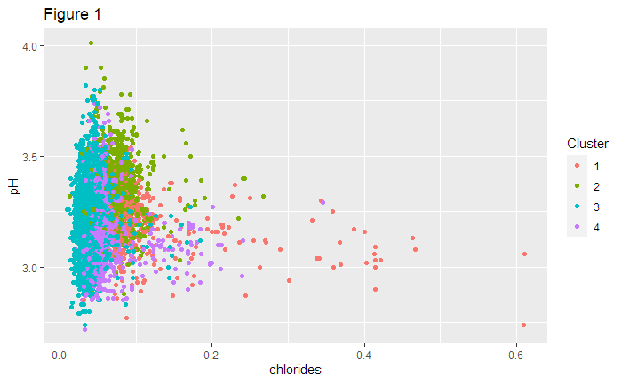{height=100%} 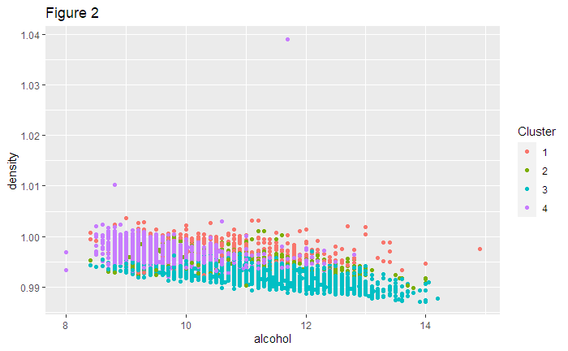{height=100%}
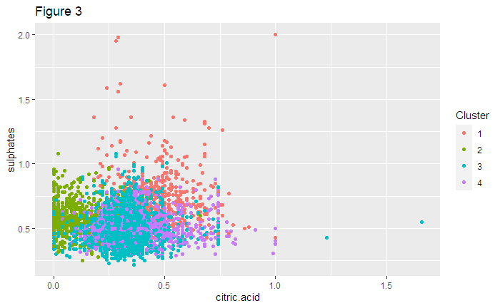{height=100%} 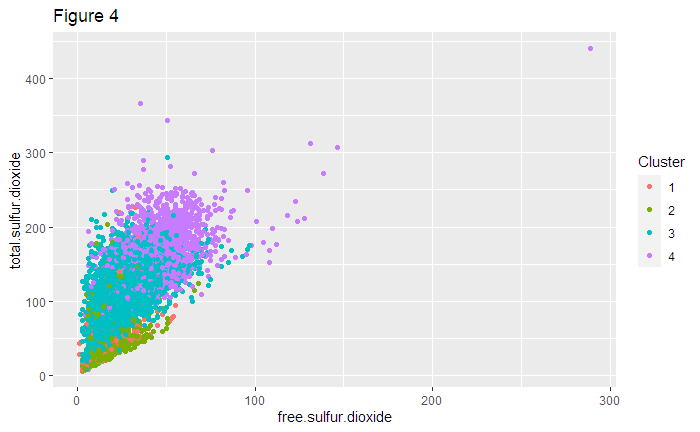{height=100%}

\newpage
In Figure 5 below, the 4 clusters are plotted against wine color. The visual evidence is striking, demonstrating a clear distinction between red and white within the clusters. Clusters 1 and 2 contain nearly all the red wines, while clusters 3 and 4 contain nearly all the white wines. There are only a handful of red wines in clusters 3 and 4, and there are only a handful of white wines in clusters 1 and 2. Overall, these clusters do an excellent job of grouping the wines into their correct colors using only the chemical properties information. 

However, as evidenced in FIgure 6, the clusters do *not* do a good job of distinguishing quality. It is worth mentioning that when 10 clusters are used, there is no improvement. Each cluster contains wines from nearly every quality group. There is a little bit of quality information captured when comparing cluster 1 to cluster 3. Cluster 1 contains mainly wines of quality 7 and below, while cluster 3 contains mainly wines of quality 5 and above. Other than this, there is very little quality-level information distinguished by clustering. This may not be surprising since the clusters did an excellent job of distinguishing red from white, and there is no relationship between color and quality. Red and white wines can both be of low or high quality. So, the clusters' predictive information is tied to color, which is unrelated to quality, and therefore contain little information on quality. Due to this trade-off, the clustering was not capable of distinguishing between higher and lower quality wines, but did an excellent job distinguishing color.

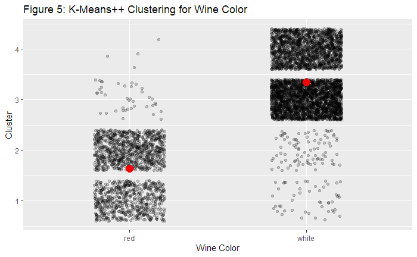{height=100%} 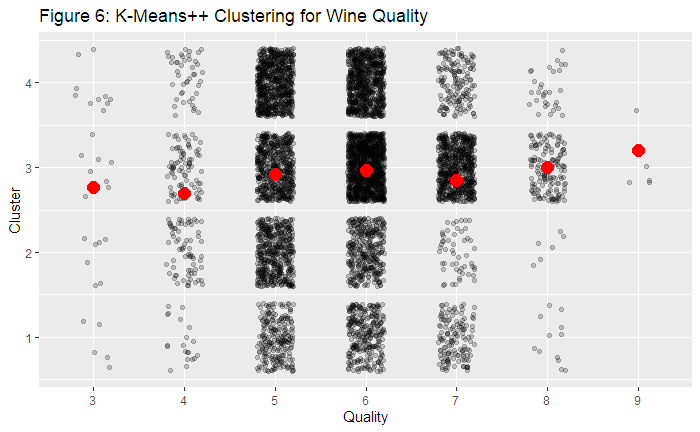{height=100%} 


```{r wine_pca1, include=FALSE, echo=FALSE, message=FALSE, warning=FALSE}

##----------PCA----------##
#Reduce Dimensions to 1 PC Scores
pc_X = prcomp(X, rank=2)
pc_X$rotation
summary(pc_X)

# Let's make some plots of the shows themselves in 
# PC space, i.e. the space of summary variables we've created
wine = merge(wine, pc_X$x[,1:2], by="row.names")
wine = rename(wine, Wine = Row.names)


# principal component regression: color
wine <- wine%>%
  mutate(color_code = ifelse(color=="red",1,0))
lm1 = lm(color_code ~ PC1, data=wine)
summary(lm1)
plot(color_code ~ fitted(lm1), data=wine)


# How well do the PCA Scores classify color (red vs white)?
ggplot(wine) + 
    geom_jitter(aes(x=factor(color), y=PC1, color=PC2), width=0.1, alpha=0.2) + 
    stat_summary(aes(x=factor(color), y=PC1, color=PC2), fun='mean', col='red', size=1) +
  labs(title = "Figure 7: PCA Scores for Wine Color",
         x = "Wine Color",
         y = "PC1")

# How well do the PCA scores classify quality?
ggplot(wine) + 
    geom_jitter(aes(x=factor(quality), y=PC1, color=PC2), width=0.2, alpha=0.2) + 
    stat_summary(aes(x=factor(quality), y=PC1, color=PC2), fun='mean', col='red', size=1) +
    labs(title = "Figure 8: PCA Scores for Wine Quality",
         x = "Quality",
         y = "PC1")
```
For comparison, I created 2 PC scores to categorize the wines by color and quality. THe PCA did *not* do as good a job at classifying the wines by color, compared to the clusters. There is more visual ambiguity in the two PC scores across the colors. Figure 7 shows that the first PC score does an okay job of separating wines by color, but with a lot more overlap than the clusters, which were far more distinct. The second score (PC2) is homogeneously distributed within the PC1 distinction, adding no additional classification information. In Figure 8, the PC scores show no capacity to distinguish wines by quality. Both PC scores contain wines of all quality levels, and PC1 gives roughly the same distribution of values across all quality scores. Overall, the PC scores do a poor job of distinguishing quality and a good job of distinguishing color. However, the clusters do a far better job of of distinguishing color and a slightly better job for quality. Therefore, the clustering technique is superior for this analysis. 

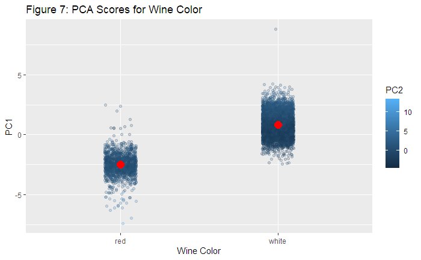{height=100%} 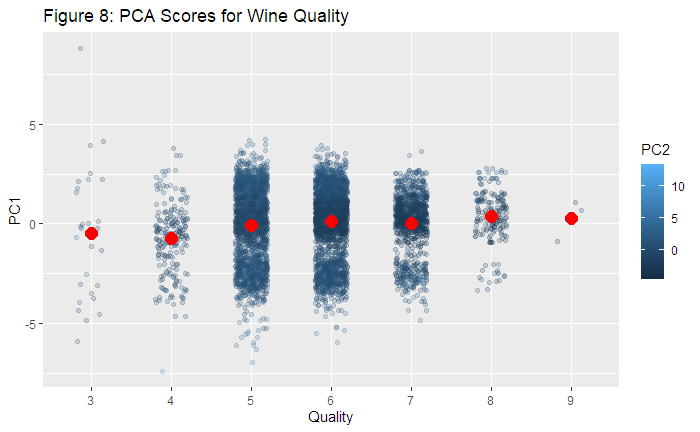{height=100%}
 

\newpage
# Problem 2: Market Segmentation
```{r market_setup, include=FALSE, echo=FALSE}
library(LICORS)  # for kmeans++
library(foreach)
library(mosaic)
market <- read.csv("~/UT MA Program/Spring 2021/Data Mining & Statistical Learning/ECO395M/data/social_marketing.csv")

# Center and scale the data
X_market = market[,(2:37)]
X_market = scale(X_market, center=TRUE, scale=TRUE)
```

```{r market1, include=FALSE, echo=FALSE, message=FALSE, warning=FALSE}

#CLUSTERING#
##----------Optimal K----------##
#Elbow plot
library(foreach)
k_grid = seq(2, 30, by=1)
SSE_grid = foreach(k = k_grid, .combine='c') %do% {
  cluster_k = kmeanspp(X_market, k, nstart=25) #switch out X with new vector for market segmentation data 
  cluster_k$tot.withinss
}
plot(k_grid, SSE_grid) 

##----------Kmeans++ Clustering using K = 5----------##

#Cluster the data
clust = kmeanspp(X_market, k=5, nstart=25)

#Plot Clusters
qplot(cooking, food, data=market, color=factor(clust$cluster)) + labs(title="Figure 1", color="Cluster")
qplot(health_nutrition, sports_playing, data=market, color=factor(clust$cluster)) + labs(title="Figure 2", color="Cluster")
qplot(shopping, fashion, data=market, color=factor(clust$cluster)) + labs(title="Figure 3", color="Cluster")
qplot(crafts, art, data=market, color=factor(clust$cluster)) + labs(title="Figure 4", color="Cluster")
qplot(eco, outdoors, data=market, color=factor(clust$cluster)) + labs(title="Figure 5", color="Cluster")
qplot(politics, current_events, data=market, color=factor(clust$cluster)) + labs(title="Figure 6", color="Cluster")
qplot(travel, photo_sharing, data=market, color=factor(clust$cluster)) + labs(title="Figure 7", color="Cluster")
qplot(computers, online_gaming, data=market, color=factor(clust$cluster)) + labs(title="Figure 8", color="Cluster")

  
```
## Pre-Processing
I chose to use k-means++ clustering to identify market segments from the users data. I used an elbow plot to first choose the optimal number of clusters. The elbow plot below demonstrates the trade-off between within-distance (cluster tightness) and complexity. As you increase K, you get improvements in cluster within-distance, which is desirable. However, these improvements are *decreasing*, and as you increase K, you incur a cost of more complexity. If you have too may clusters (very high K), you may be over-fitting by dividing your data into unnecessary categories. The goal is to minimize withing-distance without over-fitting with too many clusters. The optimal K, therefore, is at the *bend* in the elbow, where you are getting decreasing improvements in within-distance while maintaining a manageable (non-excessive) K. 

The optimal cluster count is roughly 7 clusters with a within-cluster sum of squares of about 200,000. However, after plotting the clusters by markets, it appears that a slightly lower cluster amount of 5 is more useful. 

Plotting the clusters by related market pairs (e.g., computers and online_gaming) reveals how the five clusters separate individuals into usable market segments. At five cluster, the within-cluster distance is slightly larger, at 215,000, but the clusters are more informative to the segmentation. 

## Report for NutrientH20
After grouping each user into groups based on their expressions of interest in different markets, I have developed a set of five market segments. While there is overlap in individuals' interest across many markets, the segments I have produced can provide some distinct groupings of users interests. To optimize your marketing, you can use these groupings to target distinct market segments. Each of the 5 market segment group I have identified can be referred to as a cluster. Below are some visualizations to understand these groups. 

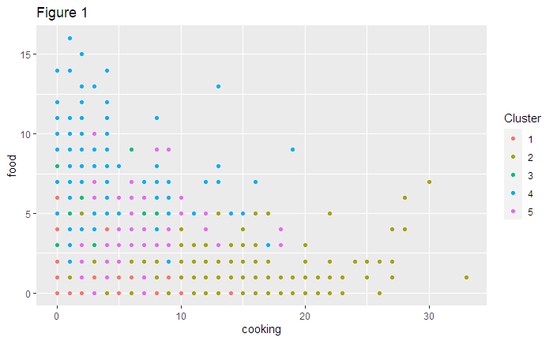{height=100%} 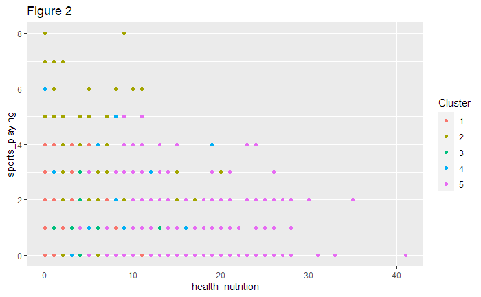{height=100%} 
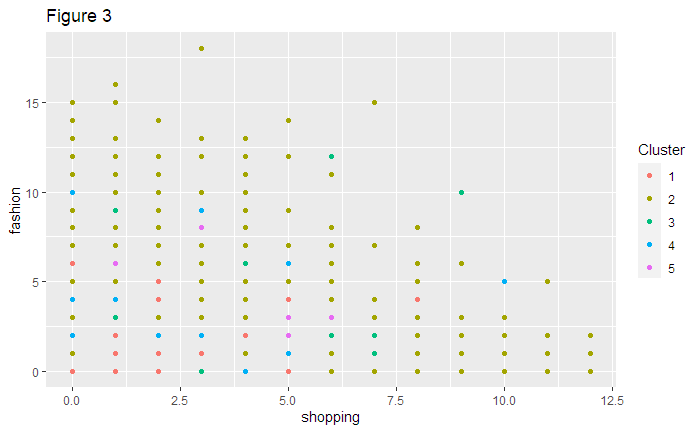{height=100%} 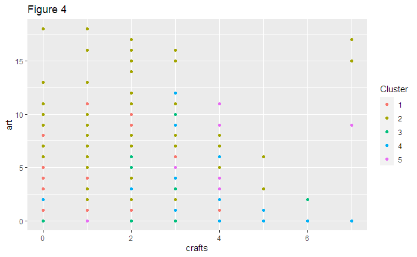{height=100%}
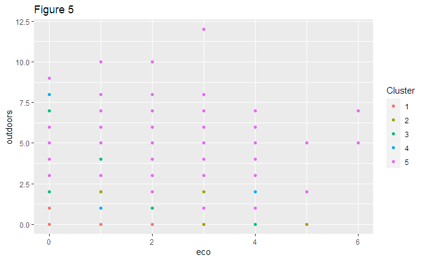{height=100%} 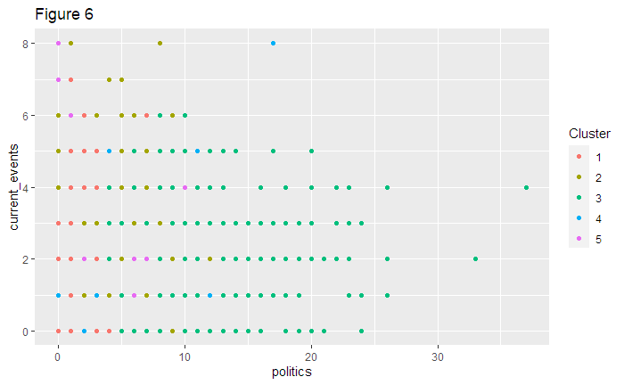{height=100%} 
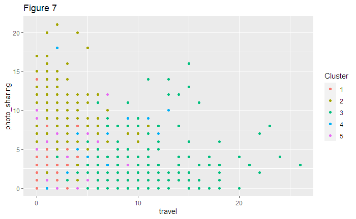{height=100%} 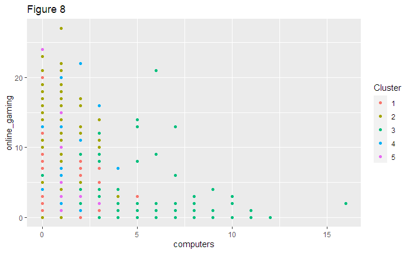{height=100%}


Cluster 1 contains the miscellaneous users how have no distinct interests in any particular market. In each of the figures below, cluster-1 individuals are sparsely represented in each market and show no particular trend, except a generally low interest in politics. To optimize your marketing, I would recommend *not* targeting these individuals because they represent an ambiguous market segment and are unlikely to respond to targeting. This frees the advertising budget for well-defined segments. 

Cluster 2 has a high interest in cooking, fashion, and shopping (Figures 1 and 3). WHile NutrientH20 does not currently have plans to associate its brand with the fashion industry, individuals interested in fashion are often susceptible to *lifestyle* marketing where a product promotes a certain type of lifestyle. In this case, NutrientH20 could associate its drink products with the lifestyles of fashionable young adults. For instance, an advertisement with Jaden Smith or Kiley Jenner could be a good way to target this group. These individuals are already interested in fashion, and by associating NutrientH20s product with this industry through a celebrity opinion leader, NutrientH20 could make its products desirable to this group. 

Cluster 3 has a very strong interest in politics, current events, and travel (Figures 6 and 7). NutrientH20 could target these users by promoting its products in the users' Twitter feed alongside news organization accounts, political pundit accounts, and travel accounts like National Geographic. THese individuals likely follow such accounts to stay tuned-in to politics,l news, and travel. By advertising next to these accounts, NutrientH20 can successfully target these users to increase sales. 

Cluster 4 has a a very high interest in food but a low interest in cooking (Figure 1). Since these individuals are likely to eat out at restaurants rather than cook at home, NutrientH20 could advertise to these individuals that their beverage products are available at trendy restaurants, like Cava and Panera. 

Cluster 5 has a high interest in health nutrition, the outdoors, and eco-friendly behavior (Figures 2 and 5). These individuals represent are a highly desirable customer segment because their interests are already aligned closely with NutrientH20's lifestyle brand image. NutrientH20 sells healthy, sporty beverages that provide carbohydrates and electrolytes to fit, adventurous, and youthful people. NutrientH20 should devote a substantial portion of its marketing budget to targeting these individuals by advertising how NutrientH20 enables a healthy and nutritious lifestyle by making fresh, eco-friendly, hydrating products for its adventurous customers. 


\newpage
# Problem 3: Association Rules for Grocery Purchases
```{r grocery_setup, include=FALSE, echo=FALSE}
library(arules)  # has a big ecosystem of packages built around it
library(arulesViz)
library(igraph)

#Read in Data as Transactions from Text File
grocer <- read.transactions("~/UT MA Program/Spring 2021/Data Mining & Statistical Learning/ECO395M/data/groceries.txt", header=FALSE, sep=",")

#Filter out baskets with only one item
#grocer_df <- grocer_df %>%
  #filter_all(any_vars(V2 != ''))

```

```{r grocery1, include=FALSE, echo=FALSE, message=FALSE, warning=FALSE}
# Association rule mining
str(grocer)
summary(grocer)

#Create rules for the shopping basket data using arules 
#Set minlen=2 to avoid empty lhs 
groctrans = as(grocer, "transactions")
summary(groctrans)
grocrules = apriori(groctrans,
                     parameter=list(support=.005, confidence=.1, minlen=2, maxlen=2))

#Inspect the rules (overall)
arules::inspect(grocrules)
#Inspect the rules for which lift is above 5
arules::inspect(subset(grocrules, lift > 3.5))
#Inspect the rules for which confidence is above 50%
arules::inspect(subset(grocrules, confidence > 0.45))
#Inspect the rules for which lift is above 5 and condience is above 50%
arules::inspect(subset(grocrules, lift > 3.5 & confidence > 0.45))

#Plot support vs confidence for all rules 
plot(grocrules)
#Plot support vs lift for all rules
plot(grocrules, measure = c("support", "lift"), shading = "confidence")

#Look at rules that drive lots of associated sales
arules::inspect(subset(grocrules, confidence > 0.25))
arules::inspect(subset(grocrules, lift > 2))
arules::inspect(subset(grocrules, confidence > 0.25 & lift > 2))

#Create Subsets by setting thresholds for lift and confidence 
sub1 = subset(grocrules, subset=confidence > 0.25 & lift > 2)
summary(sub1)
plot(sub1, method='graph')
plot(head(sub1, 100, by='lift'), method='graph')

#Export a Graph
sub1 = subset(grocrules, subset=confidence > 0.25 & support > 0.005)
saveAsGraph(sub1, file = "grocrules.graphml")
```
After removing rules for carts with either no antecedent or no consequent (blank LHS or RHS), there are 755 usable *rules* from the shopping cart data. Each rule represents an item bought in association with another other item and shows the descriptive statistics on how strong the association is (lift & confidence). Only 39 rules have lift above 3.5, meaning that the confidence of the consequent item in relation to its antecedent would be 3.5 times higher than its support. Only 9 rules have confidence above 45%, meaning that the consequent is purchased 45% of the time if the antecedent is purchased. There are no rules that have both a lift above 3.5 and confidence above 45%. 

Therefore, to set thresholds for lift and confidence, it is necessary to visualize these values for all 755 rules. Plots for confidence vs support and for support vs lift are shown below. 

```{r grocery2, include=TRUE, echo=FALSE, message=FALSE, warning=FALSE}
#Plot support vs confidence for all rules 
plot(grocrules)
#Plot support vs lift for all rules
plot(grocrules, measure = c("support", "lift"), shading = "confidence")
```
To isolate the product associations that the grocery store could promote to maximize revenue, I will set the threshold for confidence at 25% to capture strong association purchases and lift at 2 to capture the subset with confidence at least double the consequent's support. I set the confidence threshold at 25% because the confidence vs support plot above that most rules fall below this value, and there are a smattering of high-lift rules above this level. The goal is to capture a subset that is not too large to focus on to drive associative sales. I chose the lift threshold of 2 because the lift vs support plot shows a small grouping of rules above a lift of 2 that appear to be valuable high-lift outliers that also fall above the confidence threshold. These two thresholds leave a subset of 26 rules with very strong purchasing associations through which the store could bolster marketing and thus sales. For instance, seeing that sausage has a strong rule with sliced cheese may be unexpected. But knowing this, the store can now place these items closer together to promote greater lift since there is already high association. Below are the 26 rules in the subset that the store should focus on. Also shown is a key visualization fo the network of item associations. 
```{r grocery3, include=TRUE, echo=FALSE, message=FALSE, warning=FALSE}
#Show subset of 26 rules with confidence > 25% and lift > 2
arules::inspect(subset(grocrules, confidence > 0.25 & lift > 2))

#Create Subsets by setting thresholds for lift and confidence 
sub1 = subset(grocrules, subset=confidence > 0.25 & lift > 2)
plot(sub1, method='graph')
#plot(head(sub1, 100, by='lift'), method='graph')
```
The network plot is highly informative of the associative relationships of these high-lift, high-confidence rules. The node color saturation denotes lift, and the node size denotes support. The arrows denote antecedent to consequent relationships. (Note that the locations of sub-regions may not appear as described here due to knitting. The network will be the same, but its orientation on the XY plane may be changed.)The top-left region shows yogurt at the center of sub-network. Yogurt is a consequent to buttermilk, cream cheese, soft cheese, and sour cream. It appears to be a diary region, but it also contains berries and a connection to a small fruit region in the top-right. This implies there is marketing opportunity around yogurt including other dairy purchases and fruit purchases. Interestingly, there is a small offshoot from the sliced cheese node in the diary region that is connected to sausage, which has no other connections in this subset. In the lower-right there is a larger sub-region with vegetables at the center. Surrounding vegetables are various antecedents including poultry, meat, and other vegetables like onions and root vegetables. This region could be a dinner region for meat and vegetables with a few offshoots, like baking powder and grapes. Overall, this sub-region implies that there is marketing opportunity in exploiting product affinities surrounding typical dinner substrates (meat and vegetables). This may be especially profitable since the meat item (large circle in lower-left region) already has very high support, indicated by its circle size. By co-advertising its consequents in this region through point-of-purchase marketing, the store can exploit the fact that meat is a high-frequency purchase and persuade people to buy affiliated goods with high lift. 

\newpage
# Probelm 4: Author Attribution
```{r author_setup, include=FALSE, echo=FALSE, warning=FALSE, message=FALSE}
library(tidyverse)
library(tm)
library(gamlr)
library(glmnet)
library(SnowballC)
library(slam)
library(proxy)
library(lattice)
library(purrr)
library(rsample)
library(caret)
library(modelr)

#Define reader function
readerPlain = function(fname){
				readPlain(elem=list(content=readLines(fname)), 
							id=fname, language='en') }
#Create TRAINING Data Corpus
train_dirs = Sys.glob('~/UT MA Program/Spring 2021/Data Mining & Statistical Learning/ECO395M/data/ReutersC50/C50train/*')
file_list = NULL
labels_train = NULL
for(author in train_dirs) {
	author_name = substring(author, first=129)
	files_to_add = Sys.glob(paste0(author, '/*.txt'))
	file_list = append(file_list, files_to_add)
	labels_train = append(labels_train, rep(author_name, length(files_to_add)))
}
corpus_train = Corpus(DirSource(train_dirs))

  #Tokenization across all documents in the corpus
  corpus_train = corpus_train %>% tm_map(., content_transformer(tolower)) %>% 
        tm_map(., content_transformer(removeNumbers)) %>% 
				tm_map(., content_transformer(removeNumbers)) %>% 
				tm_map(., content_transformer(removePunctuation)) %>%
				tm_map(., content_transformer(stripWhitespace)) %>%
				tm_map(., content_transformer(removeWords), stopwords("SMART"))

#Create TESTING Data Corpus
## Same operations with the testing corpus
test_dirs = Sys.glob('~/UT MA Program/Spring 2021/Data Mining & Statistical Learning/ECO395M/data/ReutersC50/C50test/*')
file_list = NULL
labels_test = NULL
for(author in test_dirs) {
	author_name = substring(author, first=128)
	files_to_add = Sys.glob(paste0(author, '/*.txt'))
	file_list = append(file_list, files_to_add)
	labels_test = append(labels_test, rep(author_name, length(files_to_add)))
}
corpus_test = Corpus(DirSource(test_dirs)) 

  #Tokenization across all documents in corpus
  corpus_test = corpus_test %>% tm_map(., content_transformer(tolower)) %>% 
				tm_map(., content_transformer(removeNumbers)) %>% 
				tm_map(., content_transformer(removePunctuation)) %>%
				tm_map(., content_transformer(stripWhitespace)) %>%
				tm_map(., content_transformer(removeWords), stopwords("SMART")) 
  
#Create Document-Term Matrix (DTM) for Train and Test sets 
  DTM_train = DocumentTermMatrix(corpus_train)
  DTM_train # some basic summary statistics
  # restrict test-set vocabulary to the terms in DTM_train

##Reduce Sparsity by removing low-frequency terms 
#Removes terms that have count 0 in >90% of docs.  
DTM_train = removeSparseTerms(DTM_train, 0.9)
#Limit Test Set to terms used in training set (after sparsity step)
DTM_test = DocumentTermMatrix(corpus_test, control = list(dictionary=Terms(DTM_train)))

#dict<-findFreqTerms(DTM_train,5)
#DTM_test <- DocumentTermMatrix(corpus_test)
#DTM_test <- DocumentTermMatrix(corpus_test, control = list(dictionary=dict))


DTM_train 
DTM_test
dtm_train <- as.matrix(DTM_train)
dtm_train <- as.data.frame(dtm_train)
dtm_test <- as.matrix(DTM_test)
dtm_test <- as.data.frame(dtm_test)

#Create blank Outcome Vector
  # Use string cleaning to 
y_train = labels_train
y_test = labels_test

##Weighting: Construct TF IDF weights
tfidf_train = weightTfIdf(DTM_train)
tfidf_test = weightTfIdf(DTM_test)

#Convert everything to Matrices and Combine into Train Matrix and Test Matrix
X_train = as.matrix(tfidf_train)
Y_train = as.matrix(y_train)
train <- cbind(Y_train,X_train)
train <- as.data.frame(train)

X_test = as.matrix(tfidf_test)
Y_test = as.matrix(y_test)
test <- cbind(Y_test,X_test)
test <- as.data.frame(test)

# Turn author into a factor
train$V1 = factor(train$V1)
test$V1 = factor(test$V1)

#Add Index to Keep Sorting
train$ID <- seq.int(nrow(train))
test$ID <- seq.int(nrow(test))


##Dimensionality Reduction
#PCA on term frequencies
pca_train = prcomp(X_train, rank = 100, scale=TRUE)
summary(pca_train)
pca_test = prcomp(X_test, rank = 100, sclae=TRUE)
  plot(pca_train) 
  pca_train$x[,1:2]
PCA_train <- merge(train, pca_train$x[,1:100], by="row.names")
  PCA_train <-PCA_train[order(PCA_train$ID),]
PCA_test <- merge(test, pca_test$x[,1:100], by="row.names")
  PCA_test <- PCA_test[order(PCA_test$ID),]
#train_pca = cbind(Y_train,PCA_train)
#test_pca = cbind(Y_test, PCA_test)

#Remove unnecessary variables
train_pca <- PCA_train %>% 
  select(V1, PC1, PC2, PC3, PC4, PC5, PC6, PC7, PC8, PC9, PC10, PC11, PC12, PC13, PC14, PC15, PC16, PC17, PC18, PC19, PC20, PC21, PC22, PC23, PC24, PC25, PC26, PC27, PC28, PC29, PC30, PC31, PC32, PC33, PC34, PC35, PC36, PC37, PC38, PC39, PC40, PC41, PC42, PC43, PC44, PC45, PC46, PC47, PC48, PC49, PC50, PC51, PC52, PC53, PC54, PC55, PC56, PC57, PC58, PC59, PC60, PC61, PC62, PC63, PC64, PC65, PC66, PC67, PC68, PC69, PC70, PC71, PC72, PC73, PC74, PC75, PC76, PC77, PC78, PC79, PC80, PC81, PC82, PC83, PC84, PC85, PC86, PC87, PC88, PC89, PC90, PC91, PC92, PC93, PC94, PC95, PC96, PC97, PC98, PC99, PC100)
test_pca <- PCA_test %>%
  select(V1, PC1, PC2, PC3, PC4, PC5, PC6, PC7, PC8, PC9, PC10, PC11, PC12, PC13, PC14, PC15, PC16, PC17, PC18, PC19, PC20, PC21, PC22, PC23, PC24, PC25, PC26, PC27, PC28, PC29, PC30, PC31, PC32, PC33, PC34, PC35, PC36, PC37, PC38, PC39, PC40, PC41, PC42, PC43, PC44, PC45, PC46, PC47, PC48, PC49, PC50, PC51, PC52, PC53, PC54, PC55, PC56, PC57, PC58, PC59, PC60, PC61, PC62, PC63, PC64, PC65, PC66, PC67, PC68, PC69, PC70, PC71, PC72, PC73, PC74, PC75, PC76, PC77, PC78, PC79, PC80, PC81, PC82, PC83, PC84, PC85, PC86, PC87, PC88, PC89, PC90, PC91, PC92, PC93, PC94, PC95, PC96, PC97, PC98, PC99, PC100)


# Look at the loadings
pca_train$rotation[order(abs(pca_train$rotation[,1]),decreasing=TRUE),1][1:25]
pca_train$rotation[order(abs(pca_train$rotation[,2]),decreasing=TRUE),2][1:25]

##-----MODELS-----##
#Multinomial Logistic Regression (outcomes are categorical variables)
library(nnet)
##Choose the level of our outcome that we wishto use as our baseline.
##Specify this in the relevel function
train_pca$V2 <- relevel(train_pca$V1, ref = "AaronPressman")
test_pca$V2 <- relevel(test_pca$V1, ref = "AaronPressman")

##Run Multinomial Model using PCA Scores
ml2 <- multinom(V1 ~ . -V1 -V2, MaxNWts = 7550, data = train_pca)

##Predict using multinomial model
yhat_test = predict(ml2, test_pca, type = 'class')
yhat <- as.matrix(yhat_test)
compare <- cbind(Y_test,yhat)
compare <- as.data.frame(compare)
compare <- compare %>%
  mutate(correct = ifelse(V1==V2, 1, 0)) %>%
   group_by(V1) %>%
  summarize(pct_accuracy = sum(correct)/50*100)

#Average Accuracy
mean(compare$pct_accuracy)
sd(compare$pct_accuracy)

##___GLMNET___##
#Remove unnecessary variables
train_pca3 <- PCA_train %>% 
  select(PC1, PC2, PC99, PC100)
test_pca3 <- PCA_test %>%
  select(PC1, PC2, PC99, PC100)
#Select specific common dictionary

#Run model
lasso1 <- cv.glmnet(data.matrix(DTM_train), Y_train, family='multinomial', type.multinomial="grouped", nfold=5, alpha =1)
plot(lasso1)
##Predict using glmnet model
yhat_test2 <- predict(lasso1, data.matrix(DTM_test), s = "lambda.min", type = "class")
yhat2 <- as.matrix(yhat_test2)
 colnames(yhat2) <- c("Predicted") 
compare2 <- cbind(Y_test,yhat2)
compare2 <- as.data.frame(compare2)
compare2 <- compare2 %>%
  mutate(correct = ifelse(V1==Predicted, 1, 0)) %>%
   group_by(V1) %>%
  summarize(pct_accuracy = sum(correct)/50*100)

#Average Accuracy
mean(compare2$pct_accuracy)
```
Separate training and testing corpuses were provided to predict authorship of documents. Both corpuses contain 2,500 documents (50 authors by 50 documents each). My first pre-processing step was to *tokenize* these corpuses. I used 5 tokenization processes: (1) transform all words to lower-case, (2) remove numbers from the text, (3) remove punctuation from the text, (4) remove/split-on blank spaces, and (5) remove *stop words* (i.e., filler words: is, a, of, been, etc.). 

I then created separate train and test Document-Term Matrices (DTMs). Each DTM contained 2,500 documents (50 authors by 50 articles) by 31,423 terms. Inspecting the DTMs revealed that tokenization was successful in producing discrete, actual words (i.e., access, accounts, agencies, announced, bogus, business, etc). 

Since most of these terms only occur in one document, the DTMs were highly sparse. Therefore, it was essential to keep only the terms that show up across multiple documents, as these will be terms useful for author attribution prediction. Therefore, I removed terms in the training DTM that showed up zero times in more than 99% of training corpus documents. This step reduced the amount of terms to just 3,076. Finally, to simplify prediction on the test set, I restricted the terms in the test set to only those 3,076 defined in the reduced training set.  

I next standardized the observations in each DTM using a combination of two weighting techniques: Term-Frequency Weighting (TF) and Inverse-Document Frequency Weighting (IDF). With TF weighting, I accounted for the fact that some documents are longer than others and therefore have greater frequency of certain terms relative to shorter documents. This weighting reduces the impact of long documents' terms to be equivalent to that of shorter documents. Using IDF weighting, I down-weighted certain terms that show up frequently across all documents but that are not actually useful. For instance, since these documents are from corpus of news articles, there will be certain frequent terms that are common to news articles but that are not idiosyncratic to author and therefore should be removed to improve prediction and reduce noise. These weighting methods alter the value assigned to each token in each document in the DTMs and resulted in matrices of the same size as before (2,500 by 3,076) but with newly-weighted observations. 

Since the weighted matrices still contained somewhat high sparsity (many observations of 0), I used Principal Components Analysis (PCA) to reduce the matrix dimensions to 100 principal components scores. All 2,500 documents were assigned 100 scores (PC1 to PC100) related to the composition of 3,076 terms in each document. This enables documents to be compared for commonality and difference by how close their scores are while reducing the matrix sparsities. Using these scores, it is possible to determine which documents are similar to one another and thereby help predict authorship of each document using a prediction model. The summary of the PC scores shown below demonstrates that roughly 24% of the variation in the 3,076 terms is cumulatively explained by the PC scores.  

```{r author_output1, include=TRUE, echo=FALSE, warning=FALSE, message=FALSE}
#PC Summary
summary(pca_train)
```

### Multinomial Logit Model 
I created two models, the first of which was a Multinomial Logit Model where each author (outcome) is read as a factor, and each of 100 PC scores is a predictor variable. I combined the outcome matrix of 2500 authors with the DTM training set matrix of 100 PC scores so that the model could read the covariates and outcome from the same data frame. The coefficients of the multinomial logit model are shown below.

```{r author_output2, include=TRUE, echo=FALSE, warning=FALSE, message=FALSE}
#Show model coefficients
#head(ml2)
```

### Multinomial Lasso Model 
The second model is a cross-validated  Multinomial Lasso Model. Instead of using all 100 PC scores like in the first model, Instead of using weighted, PC-scored covariates, I used the raw terms from the training DTM dictionary to create the model, and predicted on the raw terms of the test DTM. The reason is explained below after the plot of the lasso model just underneath here: 

```{r author_output3, include=TRUE, echo=FALSE, warning=FALSE, message=FALSE}
#Show model plot
plot(lasso1)
```

Before I show the out-of-sample prediction accuracy results, I should mention that I had an issue with restricting the vocabulary of my test DTM to include the same terms as my training DTM. WHen you tokenize the training corpus and testing corpus, you get different *vocabularies* or *dictionaries* of terms. In order for prediction to be effective, it is important that you restrict the test set vocabulary to only that of he training set, so that you are using the same covariates (words) to predict outcomes on the test set as are available in the test set. This was not the case here. My restriction code (DTM_test = DocumentTermMatrix(corpus_test, control = list(dictionary=Terms(DTM_train)))) only restricted my testing DTM to have the same *amount* of terms, not the same terms as the training DTM. Therefore, my prediction accuracy is extremely low since the training and testing matrices are dissimilar. This is also why the PCA analysis did not help--it produced PC scores based on totally different vocabularies. In fact, any correct predictions are likely due more to chance. There is nothing wrong with the model, but rather the inputs. And this proved to be an unassailable problem. I scoured the internet and reached out for help to figure out why this code was not working, but as far as I can tell, it is the right line of code, but it just does not do what it is meant to do. So, please take into the account that I can identify the main reason my prediction accuracy is so low, have tried to fix it, and am unable to despite exhausting every resource. 

### Model 1 Results 
The prediction accuracy for the first model (multinomial with 100 PC scores) is about 1.92%. This means that out of all 2,500 documents whose authorships I predicted in the test set, only 48 were correct. Below are a histogram and scatterplot of prediction accuracies across all authors. Since each author had 50 documents, there were 50 opportunities to correctly predict authorship for each author. The histogram shows that most predictions overall were wrong (0), and the scatterplot shows that i predicted authorship of at least one document correctly for only two authors (Michael Connor and Roger Fillion). The model did an excellent job of assigning correct authorship to Roger Fillion, and a dismal job for all 49 other authors. Again, this failure is attributed to the different dictionaries of the training and testing sets, which could not be rectified. If the training and testing sets had the same set of terms, these predictions would be much improved. So, I suffer a technical limitation, not a methodological failure. 

```{r author_output4, include=TRUE, echo=FALSE, warning=FALSE, message=FALSE}
#Show prediction results

#Histogram of accuracy
library(ggplot2)
ggplot(compare) +
  geom_histogram(aes(x = pct_accuracy)) +
  labs(title = "Model 1 Histogram of Prediction Accuracy Across 50 Authors",
       x = "Percent Accuracy")
#Bar Plot of Accuracy
ggplot(compare) + 
  geom_point(mapping = aes(x=V1, y=pct_accuracy)) +
  labs(title = "Model 1 Out-of-Sample Prediction Accuracy by Author (MODEL 1)",
       x = "Author Name",
       y = "% Documents Correctly Atributed to Author") +
  theme(axis.text.x = element_text(angle = 90))
```

### Model 2 Results 
The prediction accuracy for the second model (lasso multinomial) is much better than model 1. This is because I did not use PC scores to summarize the terms. By leaving the raw terms in both the training and testing sets for prediction, I was able to capture information from the subset of terms that actually overlap between the training and testing set. Again, this relates back to my core problem of different dictionaries. If I could have a common dictionary across both the training and testing sets, then the PCA dimensionality reduction may have actually been useful. Insofar as I am stuck with different dictionaries due to technical issue, the happenstance overlap of certain terms in the raw dictionaries is the best means of predicting authorship. Below, you can see that using the raw terms as predictor variables enabled far more correct predictions (though still very little overall), resulting in an average authorship prediction accuracy of 3.12%--nearly 3 times greater that with PC scores. The scatterplot shows that instead of just 2 authors with some correct predictions, this model correctly predicts at least one document for 21 authors. The remaining 29 authors did not have a single correct document assigned during prediction. The ability of this model to capture some predictive information despite totally different dictionaries implies that there are likely some high-frequency terms that were present in both dictionaries. The rest of the terms in the testing set, because they were not restricted to the training set dictionary, simply were not usable, and the terms in the training set that were not in the testing set created immense predictive noise. If dictionary restriction could have been accomplished, this noise would have been removed, and the PC scores could have been useful. 

```{r author_output5, include=TRUE, echo=FALSE, warning=FALSE, message=FALSE}
#Show prediction results

#Histogram of accuracy
library(ggplot2)
ggplot(compare2) +
  geom_histogram(aes(x = pct_accuracy)) +
  labs(title = "Model 2 Histogram of Prediction Accuracy Across 50 Authors",
       x = "Percent Accuracy")
#Bar Plot of Accuracy
ggplot(compare2) + 
  geom_point(mapping = aes(x=V1, y=pct_accuracy)) +
  labs(title = "Model 2 Out-of-Sample Prediction Accuracy by Author",
       x = "Author Name",
       y = "% Documents Correctly Atributed to Author") +
  theme(axis.text.x = element_text(angle = 90))
```

I should reiterate that I actually got as high as 11% accuracy when choosing two random words from the terms list in the DTM to use as predictor variables. However, since the DTM is so sparse, the model could not handle any more words, let alone the entire set (hundreds). So dimensionality reduction was required. I felt pressured to use a more complex methodology (dimensionality reduction) since the directions called for this rather than to go with the simpler model just described that produced better predictions. My main problem here is in restricting the test DTM to the dictionary of the training DTM, as discussed. I have tried many different versions of the statement that is supposed to do this (DocumentTermMatrix(corpus_train, control = list(dictionary=Terms(DTM_train)))), however it never works. Therefore, my training and testing DTMs have different terms. I am trying to use covariates from the training matrix that are not in the testing matrix to to out-of-sample prediction, so naturally, the prediction will be poor. Unless I can get this dictionary-restriction code to work (there is no clear reason why it should not), I will continue to get very poor prediction accuracy. 
